March Madness Filtering Frenzy
===
*Created By: Anthony Coutts, Peter Czepiel, Timothy Hutzley, Yanhong Liu*

# Process Book

## Project Background:

### Overview:
- Our project is an interactive visualization that allows the user to apply several filters to a dataset of every College Basketball team that made it to the March Madness Tournament between the years 2013-2023. Our site is broken up into two halves, with the top half containing our five different filtering options, and the bottom half housing the collection of teams that apply to the current filters. All five filters work together to show only relevant teams.

### Motivation:
- We were motivated to create a project in this topic due to personal interest. Members of our team are avid basketball enjoyers that wanted an effective and aesthetically pleasing way to see different statistics about the best College Basketball teams of the past years. We also hoped that our site would make the March Madness Tournament easier to understand for users that want to become fans of College Basketball but may not currently have the best understanding.

## Related Work:
- We were heavy inspired by the interactive visualization called Selfiexplanatory (part of SelfieCity) that we looked at during class. This site stood out to our team due to its immense scale and variety of sampling techniques. We really liked how they chose to display their filtering options in a non-traditional way (for example: showing distribution graphs for the user to click on) and we chose to implement similar non-traditional filtering components wherever possible. 
- Here is the link to the original site: [SelfieCity](https://selfiecity.net/selfiexploratory/?dataset=%5Blondon%5D)

## Questions:
- The question that our group initially wanted to answer was:
    - Is there a better alternative to learning about college basketball statistics than looking at tables and mathmatically analysis?
- We wanted to prove that creating an interactive visualization site like SelfieCity would make it easier for everyone (experts and casuals) to understand various statistics about many different college basketball teams. This question never changed over the course of our project, but we developed a lot of new analytical questions that could be answered using our visualization site. Some of these include (there is many possible ones):
    - Did all winning teams have a three point shooting percentage of a certain range?
    - Are 1 seed teams more likely to win March Madness?
    - Which year of March Madness had the teams with the highest regular season winning percentage?
    - Did teams the won the championship have lower 2 points scored by opponents on average?

## Data:
### Source:
- We gathered out data from a database created by Bart Torvik. Starting back in 2008, Bart Torvik began collecting and analyzing data on College Basketball to allow himself to make better March Madness Brackets, with the hope of being the first person to create the perfect bracket (all chosen teams win their matchups). Torvik took data from free online databases like [Sports Reference](https://www.sports-reference.com/cbb/) and performed advanced statistics techniques that he created (like T-Rank and Project Effective Talent). Eventually Bart Torvik made his data analysis public and free by creating the website where we got our data: [barttorvik.com](https://barttorvik.com/#)

### Cleaning and Usage:
- The website where we got our data from ([barttorvik.com](https://barttorvik.com/#)) featured an abundance of categories. Our group chose 14 categories that we wanted to implement into our site. Below is the full list of these categories as they appear in the initial dataset:
    - TEAM
    - CONF
    - W%
    - ORB (Offensive Rebounds)
    - DRB (Defensive Rebounds)
    - FTR (Free Throw Percentage Made)
    - FTRD (Free Throw Percentage Made by Opponent)
    - 2P_O (Offensive 2 point shots made)
    - 2P_D (2 point shots made by opponent)
    - 3P_O (Offensive 3 point shots made)
    - 3P_D (3 point shots made by opponent)
    - Finish Dum (How many games each team played; used instead of POSTSEASON category)
    - SEED
    - YEAR
- During development of our site, we chose to only use 10 categories as we believed added them to our site would cause the view to become crowded. The categories we chose to later not implement were as follows:
    - ORB (Offensive Rebounds)
    - DRB (Defensive Rebounds)
    - FTR (Free Throw Percentage Made)
    - FTRD (Free Throw Percentage Made by Opponent)

## Explanatory Data Analysis:
- When we initially looked at our data on [barttorvik.com](https://barttorvik.com/#), we found that there was not many data visualizations present. On that website, all of the statistics and general numbers are displayed in table format (basically and Excel Spreadsheet) with various filters that you can apply. From looking at this, we gained the insight that more interactive and "pretty" visualizations needed to be made from this data.
- We also looked at a site with an interactive visualization on NBA player stats called [Buckets](https://buckets.peterbeshai.com/app/#/playerView/201935_2015). This gave our team some insight into how we wanted to lay out the overall page and where to place the filters we planned on making. It also helped us finalize which categories we thought we best to display.

## Design Evolution:
- Our first task in creating this final project was creating several different drawings of what the site might possibly look like. Below is two of our initial drawings:
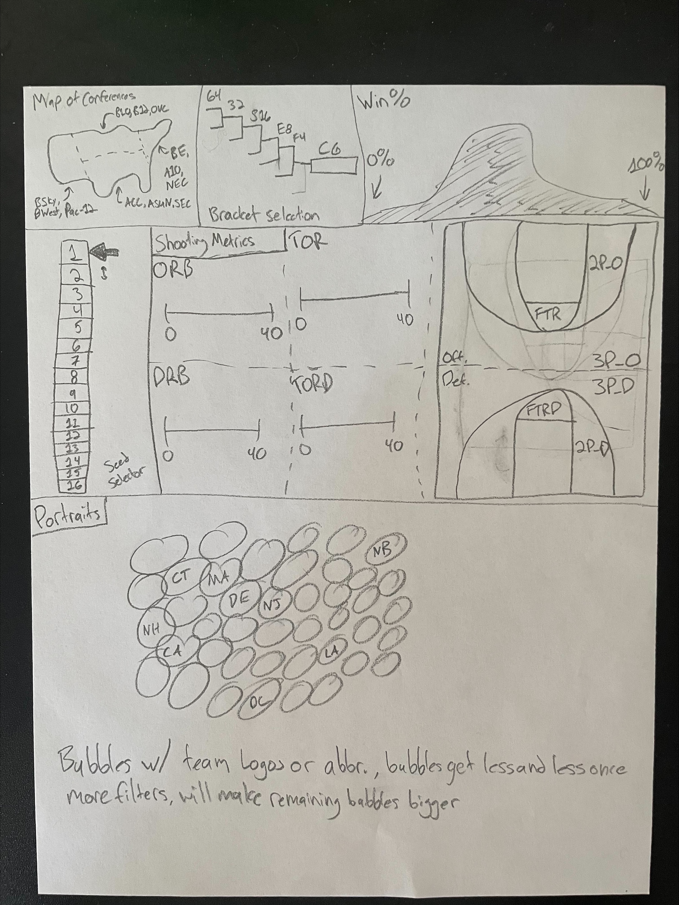
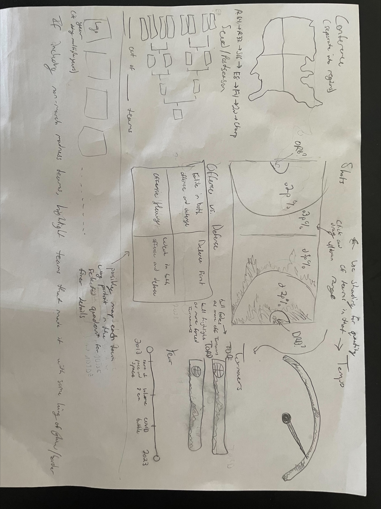
- After creating our initial ideas, we looked at both and decided what we wanted our final site to look like and what features we wanted to include. Our drawing for our final site looked like this:
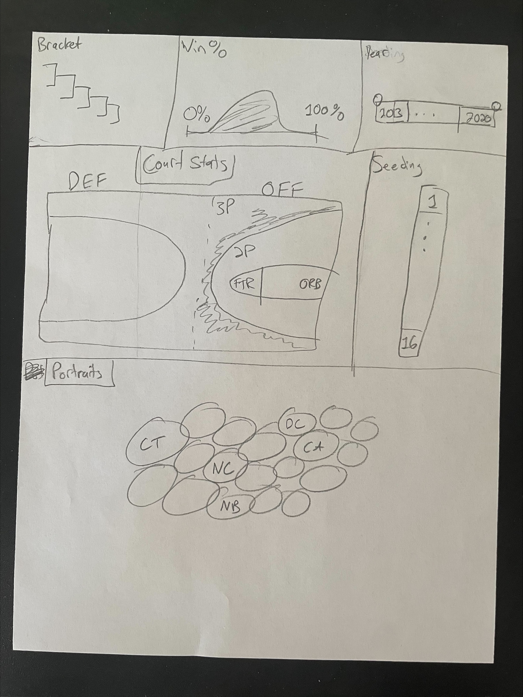
- While we had lots of possible ideas for filtering techniques, we decided to scale down to the ones we as a team deemed as essential to creating a good interactive visualization. These ended up being the five filters that we still have in the final version of our site. The only way we deviated from our proposal was scaling down a little bit due to time constraints.
- Upon going to class on Tuesday (March 3rd), we decided to change the court graphic to be two seperate vertical courts instead of one connected horizontal court. This is what the initial first draft of the coded site looked like: 
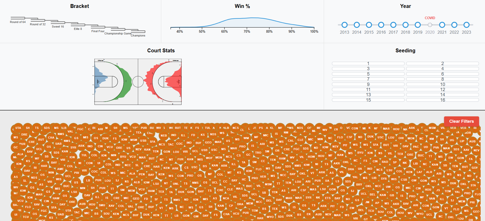
- We also created a drawing of what the new layout with the two seperated courts would look like:
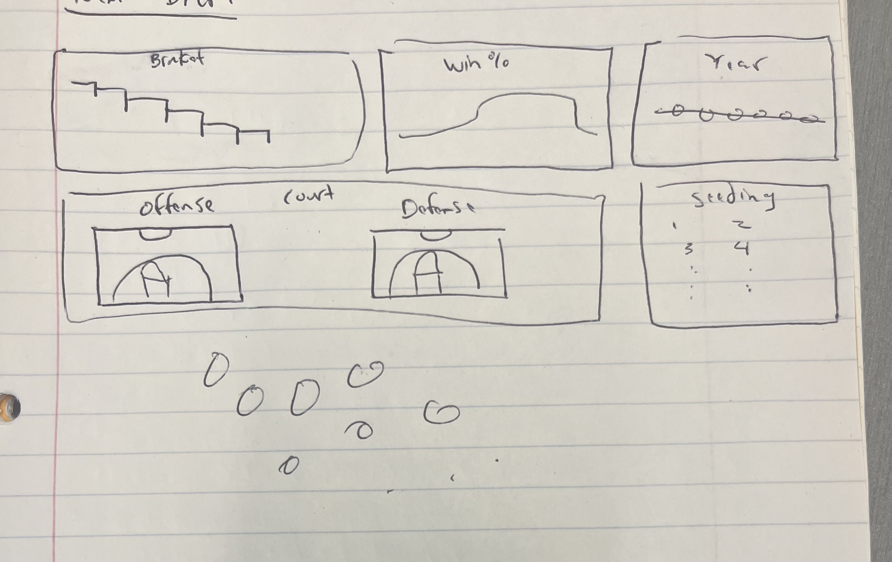
- Our very final implementation of the site looks like this:
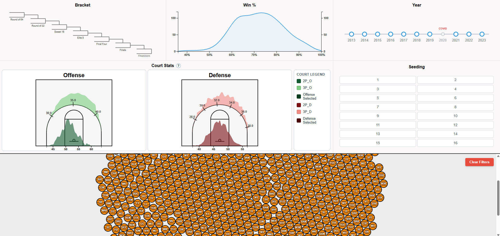
- Perceptual and Design Principles: We used many concepts from our class discussions to inform our design decisions throughout the site. To name some specifically:
    - We made sure to keep clutter to a minimum so that the user was focused on the options they had.
    - We kept colors neutral and consistent when possible, while also choosing a few elements (like the basketballs on the bottom half) to purposefully stand out from the rest of the page.
    - We chose the correct chart types to display the given data. For example, we used a standard shaded line graph to display the Win% but a timeline chart to display selected years.
    - We added a question mark button near our Court Stats visualizations to give users who may be unfamiliar with basketball some insight into the importance of these stats.

## Implementation:
- Bracket Selector:
    - This interactive filter shows a standard March Madness bracket with labels for each round of play. Users can select a given round and see all teams that made it to the selected round or further in the tournament.
    - 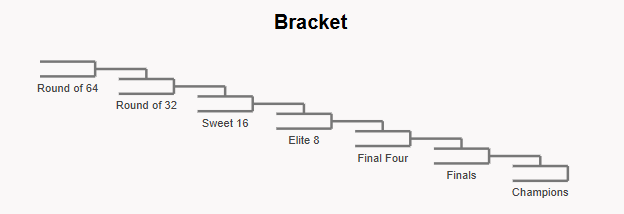
- Win% Graph Filter:
    - This interactive visualization shows a line graph of the win percentage of all teams from 40%-100% with a shaded underside. Users can draw a box on this graph to see only teams that had a win percentage between that range.
    - 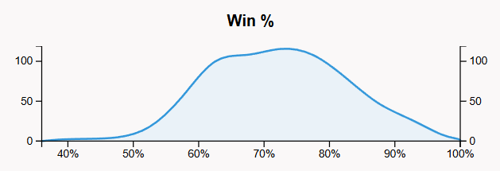
- Year Selector:
    - This interactive filter shows a timeline of years between 2013-2023 (excluding 2020 due to COVID). Users can select a given year to see only teams that were part of the tournament that year.
    - 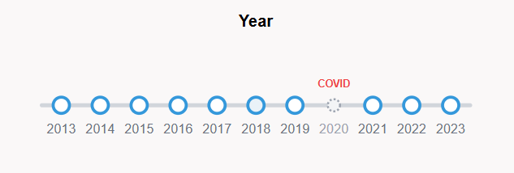
- Court Stats Filters:
    - These interactive visualizations feature SVGs of basketball courts with simple line graphs overlaid onto them. This section features two seperate court images and graphs for both offensive and defensive stats. This section also features a brief legend to explain the colors of each graph. Users can select a range on each of the four graph to see teams the scored or defended in those ranges.
    - 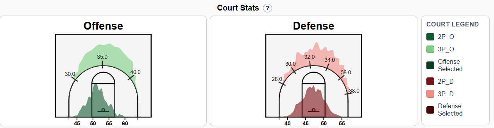
- Seeding Selector:
    - This interactive filter shows the possible seeds of teams for the March Madness Tournament (1-16). Users can select one or multiple seeds to see teams from only those seeds.
    - 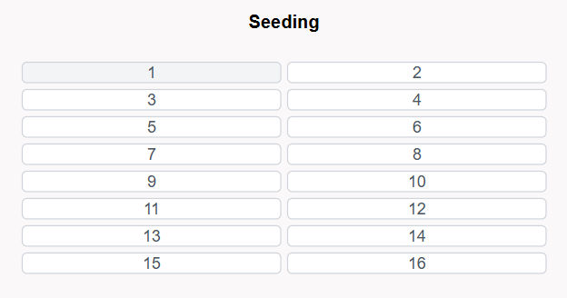
- Team Bubble Chart:
    - This interactive visualization features a collection of all the teams from the entire dataset (visualized as basketballs for aesthetics). This grouped bubble chart will change based on the ranges and numbers the user has selected on the filters above. The size and grouping of the basketballs will change based on the number of teams being displayed. These basketballs are hoverable to see more brief statistics on each team, and draggable if users want to rearrange the ordering of the basketballs.
    - 

## Evaluation:
- While making our visualizations, we learned that there was a lot of background calculation that went into many of the stats we chose to include. This was especially apparent while making our Court Stats filters as the 2P_O, 2P_D and other similar stats had been previously calculated by the creator of the dataset to make life easier for anyone trying to look for specific offense and defense stats.
- We were also able to answer our main question of: "Is there a better alternative to learning about college basketball statistics than looking at tables and mathmatically analysis?" The answer is a resounding yes as many of the people we showed the site to (and some of the group members themselves) learned a lot more about the March Madness teams by looking at our site than by looking at the tables on [barttorvik.com](https://barttorvik.com/#).
- Our big visualization (the basketball bubble chart) works very well when it comes to displaying smaller amounts of teams, however it can be a little messy once teams from all 10 years are present (and would probably be worse with more years). To improve this we could tweak the physics of the bubbles and their size/spacing to be able to better display more teams. However, other than this we believe our visualization does what we intended it to do.

# Project Website Link
- Our final website can be found at this link: [Project Website](https://peczepiel.github.io/finalproject/)
- Here is the link to our project screen recorded walkthrough: Project Screencast
- Here is a link to the Process Book in PDF form (same as above but PDF format): Process Book

# Outside Libraries and References:

## Libraries:
- [d3.js](https://d3js.org/)

## References:
- [barttorvik.com](https://barttorvik.com/#)
- [SelfieCity](https://selfiecity.net/selfiexploratory/?dataset=%5Blondon%5D)
- [Sports Reference](https://www.sports-reference.com/cbb/)
- [Buckets Visualization](https://buckets.peterbeshai.com/app/#/playerView/201935_2015)
- [Project Website](https://peczepiel.github.io/finalproject/)
